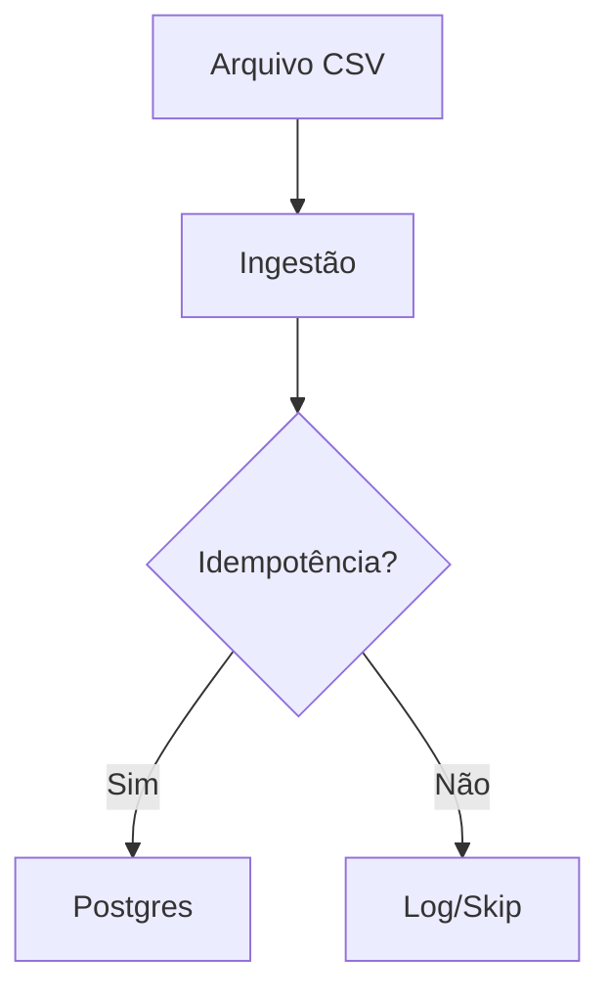

# System Design

Design detalhado com diagramas Mermaid.

```mermaid
graph TD
    A[Arquivo CSV] --> B[Ingestão]
    B --> C{Idempotência?}
    C -->|Sim| D[Postgres]
    C -->|Não| E[Log/Skip]
```
